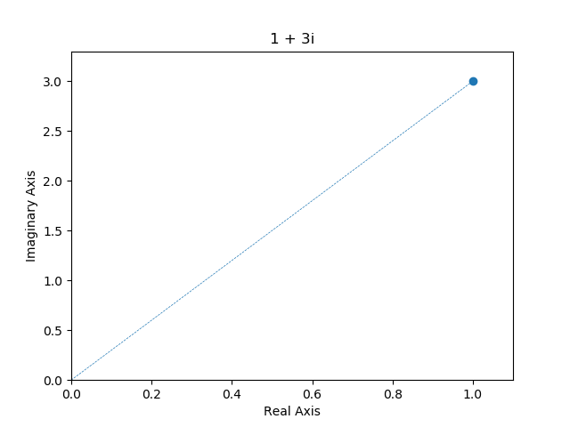

# ComplexNumbersProblemSolver
Repository Containing Functions and Classes to represent complex numbers and solve common problems

## Complex class
### Instantiation
This class implements a complex number. To instantiate the class you need to provide
two arguments, the real part of the complex number and the imaginary part. For 
instance, if we have
<a href="https://www.codecogs.com/eqnedit.php?latex=z&space;=&space;1&space;&plus;&space;3i" target="_blank"></a>
we can instantiate the class as such
`z = Complex(real=1, img=3)` or just `z = Complex(1, 3)`.
### Main attributes
Now the complex instance `z` will contain common information about
a complex number. Here are some examples:
* Get the real & imaginary parts
```{r, engine='python', code_block_name}
>>> print(z.real)
1
>>> print(z.img)
3
```
* Get the modulus and the argument
```{r, engine='python', code_block_name}
>>> print(z.modulus)
3.1622776601683795
>>> print(z.arg)
1.2490457723982544
```
### Main functions
* Print the standard & polar representation of the complex number
```{r, engine='python', code_block_name}
>>> print(z)
1 + 3i
>>> print(z.to_polar())
'3.1622776601683795e^i1.2490457723982544'
```
* Can do standard operations between complex numbers
```{r, engine='python', code_block_name}
>>> z = Complex(1, 3)
>>> w = Complex(4, 1)
>>> z + w
5 + 4i
>>> z - w
-3 + 2i
>>> z * w
1 + 13i
>>> z / w
0.4117647058823529 + 0.6470588235294118i
>>> abs(z) == z.modulus  # Can use abs(z) instead of a.modulus
True
```
* Find conjugate and reciprocal

```{r, engine='python', code_block_name}
>>> z = Complex(1, 3)
>>> z.conjugate()
1 - 3i
>>> z.reciprocal()
0.09999999999999998 - 0.29999999999999993i
```
* Printing pretty angles in radians
The class uses a function that tries to convert an angle into a 
prettier representation. For example:
```{r, engine='python', code_block_name}
>>> from math import sqrt
>>> z = Complex(sqrt(2), -sqrt(2))
>>> z.to_polar()
'2.0e^iπ/4'
```
### Problem Solving
* We can plot a single complex number as follows:
```{r, engine='python', code_block_name}
>>> import matplotlib.pyplot as plt
>>> z = Complex(1, 3)
>>> z.plot()
... plt.plot() # Optional
<matplotlib.axes._subplots.AxesSubplot object at 0x000002309E02FCC0>
```

* Find polar version of a number
```{r, engine='python', code_block_name}
>>> z = Complex(sqrt(2), -sqrt(2))
>>> z.to_polar()
'2.0e^iπ/4'
```
* Find roots of unity (static method)
```{r, engine='python', code_block_name}
>>> Complex.find_n_unity_roots(1)
1.0
>>> Complex.find_n_unity_roots(2)
[1.0, -1.0 + 1.2246467991473532e-16i]
>>> Complex.find_n_unity_roots(3)
[1.0, -0.4999999999999998 + 0.8660254037844387i, -0.5000000000000004 - 0.8660254037844385i]
```
We can also pretty-print them as follows
```{r, engine='python', code_block_name}
>>> for root in Complex.find_n_unity_roots(3):
... print(root.to_polar())
1.0e^i0.0
0.9999999999999999e^i2π/3
1.0e^i-2π/3
```